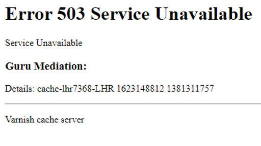

..
	Copyright (c) 2021 Varnish Software AS
	SPDX-License-Identifier: BSD-2-Clause
	See LICENSE file for full text of license

.. _phk_503aroundtheworld:

================================
The 503's heard around the world
================================

Yesterday, june 8th 2021, for about an hour, the world saw things like:

(The alert reader will notice that it says "Mediation" instead of
"Meditation".  I dont know why, but I know who to ask, and I will.)

People have, somewhat justifiably jumped on this error message,
complaining about how terse it is, for instance `Max Rozen
<https://onlineornot.com/what-fastly-outage-can-teach-about-writing-error-messages>`_
who makes some good and sensible suggestions about good and sensible
error messages.

But all his suggestions require some amount of ambient information,
information which we in the Varnish Cache project do not have and
never can have.

When Varnish gets to the bottom of the `builtin.vcl` and errors
out, we dont know where that Varnish instance runs, who it runs
for, what information it serves, who it serves that information
to and most crucially, what information can safely be shared with
the clients.

This is why the default "503 guru meditation" only mentions the
`XID`:  The XID is a nonce, for all practical purposes a random
number, but one which allows the persons responsible for that varnish
instance to dig through their logs and find out what happened to
this specific request.

The other thing I want to note, is that the one thing you absolutely
do not want to happen, is a "priority inversion", where it takes
more CPU, database accesses or bandwidth to produce the error
message, than it would have to produce the intended result.

This error message is intended to be in all respects minimal.

I'm pretty sure I have seen normal 503s from Fastly's CDN, they
dont look like this, so something must have gone badly wrong for
Fastly yesterday.

Even though I'm sure the XID did not in any way help them debug
this specific problem, I am happy to see that our "error message
of last resort" did what it was supposed to do, as it was supposed
to do it.

The first 503 stress test
-------------------------

When we release the first version of Varnish the text "Varnish cache
server" was link to the project homepage.

That link acted as a "viral marketing campaign" for us:  When
web-people saw the 503 on another webpage, often a competitors
webpage, they clicked on the link to learn what software they
were running.

And since everybody usually makes a couple of mistakes trying to get
Varnish running for the first time, more and more web-people
learned about Varnish Cache.

So word about Varnish Cache spread around the globe.

All the way to China.

Where the Chinese State Railroads rolled out Varnish Cache.

And made some kind of beginners mistake.

A lot of chinese web-people learned about Varnish Cache that day.

As did a lot of other chinese people, who instead of a train schedules
and train tickets, got a few lines of english, which the vast
majority of them did not read or understand.

But there were also a link.

They did what any sensible web-user would do.

They clicked on the link.

And dDoS'ed the Varnish Cache project server.

... and the Redpill-Linprox Data Center, where that server lived.

... and the Norvegian ISPs that announced the prefix of that data center.

In fact, they effectively dDoS'ed Norway.

(Update: I'm now being told by people from Norway that this did not
dDoS that much.  As I live in Denmark I obviously only have this
saga on second hand.  (The only effect I experienced myself was that
the Trac server was unreachable).  Somebody has exagerated the
story along the way.

However, this did prompt me to track down the precise timing:
Varnish release 2.1.2, May 2010 has the link, release 2.1.3 from
July same year does not.)

And that, my friends, is why the error message of last resort in
Varnish Cache does not even contain a link anymore.

*/phk*

PS: The title of this post is of course an homage to
`John R. Garman's famous article <https://www5.in.tum.de/~huckle/space_.pdf>`_.

