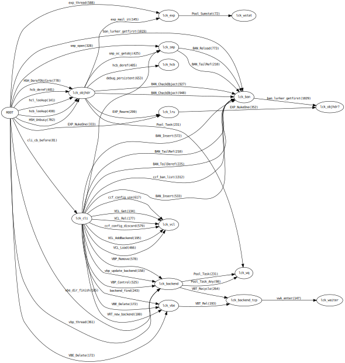

.. _phk_brinch_hansens_arrows:

=====================
Brinch-Hansens Arrows
=====================

As you may have noticed, I am a bit of a IT-history nerd, and we do have
some rather important early IT history in Denmark.

If you have a solid CS background, you have undoubtedly heard about
both dining philosophers and Brinch-Hansens work in multiprogramming.

Multiprogramming is fundamentally hard, because you cannot have one
thread holding lock A trying to get lock B, while another holds
lock B trying to get lock A.

Brinch-Hansen did a lot of both theoretical and practical work in the
area of multiprogramming and being both good at it and one of the
pioneers, he was awarded the ACM Turing Prize for it.

You can read more about him here:
`Brinch-Hansen Archive <http://brinch-hansen.net/>`_

Along the way he came up with a trivial and practical way to guarantee
that a given multiprogramming system was free of deadlocks:  Draw
the locking order and make sure all the arrows point to the right.

When we started working with multi-core systems in FreeBSD, we were
sure to have deadlocks in our future, and we adopted and expanded
a facility called "WITNESS" originally written for BSDI, which
keeps an eye on Brinch-Hansens arrows in real time.

Historically I have been pretty good at avoiding deadlocks, it seems
to come natural to me to think about locking order, but not everybody
feels that way about them, and WITNESS have caught a lot of "Ohh,
didn't think about *that*" situations over the years.

It is no accident that Varnish has a very simple locking structure,
but as we add more and more flexibility and extensibility to Varnish
it grows a little here and there, and I managed to introduce a
lock-order reversal the other day - my first in about five years I
think.

Since I'm obviously getting old and slipping up here, I though it
was about time I carried out the Brinch-Hansen check on Varnish.

I briefly pondered porting WITNESS into Varnish, but it's 3k lines
and we have extremely good code coverage in our regression tests
so I decided to KISS and do it as post-processing.

I have added default-off debug code to emit VSL "Witness" records,
taught varnishtest how to enable that code, and added a small python
script to process the records into a nice plot:

And yo and behold:  All the arrows point to the right.

*phk*

