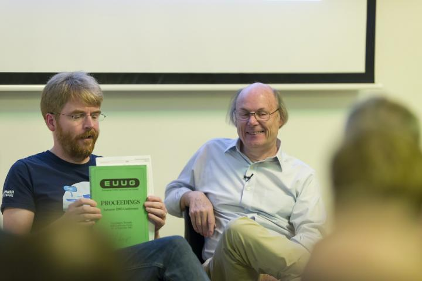

..
	Copyright (c) 2016-2017 Varnish Software AS
	SPDX-License-Identifier: BSD-2-Clause
	See LICENSE file for full text of license

.. _phk_trialerror:

==================================================
Trial&Error - Prototyping - Continuous Integration
==================================================

The other day I chatted to a friend who wrote his phd thesis with
`David Wheeler <https://en.wikipedia.org/wiki/David_Wheeler_(British_computer_scientist)>`_ as his advisor, that made me feel young, because Wheeler
was the guy who invented the subroutine.

No, not 'a subroutine' but 'the subroutine'.

In the 1980'ies, right when I had started in IT, there was the new
fashion: "Prototyping".

It was all over the place, in 1983 Datamation you could about *"Data
driven prototyping"*, and by 1990 it had bubbled up to management
and Information and Software Technology could publish *"Organization
and Management of Systems Prototyping"* etc.  etc.

The grey-beard at my workplace laconically said *"We already do that,
only we call it Trial&Error."*

Programming has always been Trial&Error, and probably always will.

All the early pioneers, like Wheeler, complained about how
batch-scheduling of machine resources removed the "intimate" contact
with the running program and argued that it prolonged the debugging
process.

Practically all the oral histories from back then are about people
sneaking into university or work at night, to get the computer for
themselves.

But we could call it "Prototyping" if that sounded better, and now
that the history-deficient dot-com generation has "invented" it,
we can call it "Continuous Integration".

I don't care - it's still Trial&Error to me.

They guy I chatted with told how after his phd thesis he
*"swore to never again attempt to solve a problem with inadequate
tools"*.

That is sound advice, and we all tend to forget it all the time,
so reminded, I did a mental inventory on the train home: Which tools
do I use even though I find them inadequate.

And then I decided to do something about them.

First thing was my lab which has - erhh... evolved? - over the last 15 years.

Some of the original assumptions were plain wrong, and a lot of "As
a temporary solution I can ..." hacks became permanent, and so on.

I spent two days cleaning, moving, shuffling and generally tidying
my lab, (Amongst other discoveries:  The original two SCSI disks
from the first "freefall.freebsd.org" machine built by Rod Grimes.)
and it is now a lot more pleasant for the work I do these days.

Second thing was the Jenkins and Travis we use for Tria^H^H^H^Continuous
Integration in the Varnish Project.

Jenkins and Travis are both general purpose
program-test-framework-cloud-thingies, and they're fine up to a
point, but they are inadequate tools for me in too many ways.

Jenkins is written in Java, which is not something I want to inflict
on computers voluntarily, in particular not on computers people lend
us to test varnish on.

Travis is Linux only, which is fine if you run Linux only, but I don't.

But worst of all:  Neither of them fully understand of our varnishtest
tool, and therefore their failure reports are tedious and cumbersome
to use.

So, taking my friends advice, I sat down and wrote VTEST, which
consists of two small pieces of code: Tester and Reporter.

The tester is a small, 173 lines, `portable and simple shell script
<https://github.com/varnishcache/varnish-cache/blob/master/tools/vtest.sh>`_
which runs on the computer, physical or virtual, where we want
to test Varnish.

It obviously needs the compilers and tools we require to compile
Varnish, (autocrap, sphinx, graphviz) but it doesn't anything
beyond that, in particular it does not need a java runtime, a
GUI or a hole in your firewall.

The tester sends a report to the project server with ssh(1), and
the reporter, which is just 750 lines of python code, ingests and
digests the report and spits out some `pidgin HTML
<http://varnish-cache.org/vtest/>`_ with the information I actually
want to see.

And just like with the varnishtest program before it, once I
had done it, my first thought was *"Why didn't I do that long time ago?"*

So it is only fair to dedicate VTEST to the friend I chatted with:

`Bjarne <http://www.stroustrup.com/>`_ tried to model how to best
distribute operating system kernels across a network, wrote a
adequate programming language tool for the job, which was also
an adequate tool for a lot of other programming jobs.

Thanks Bjarne!

Poul-Henning, 2016-11-21

