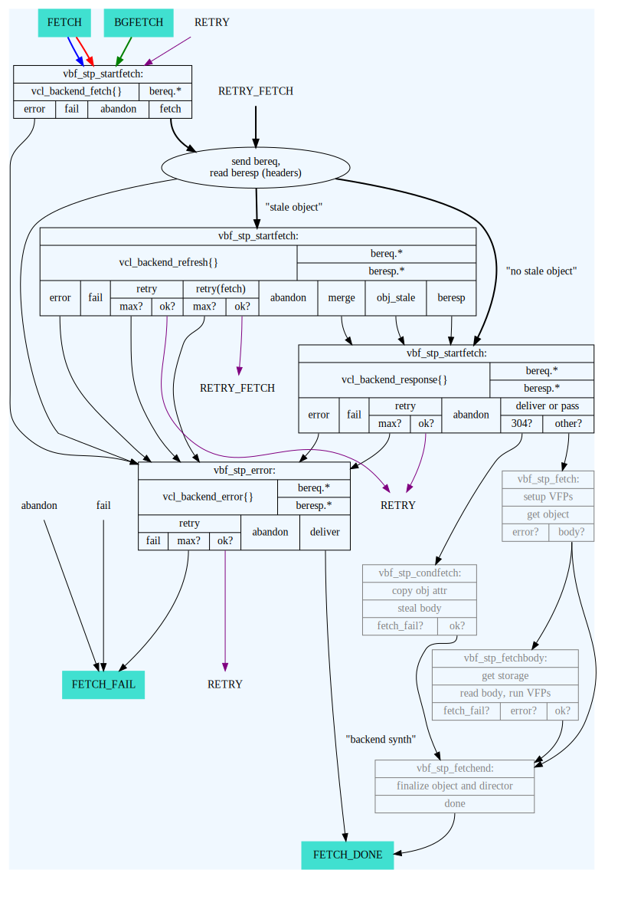

.. _reference-states:

=========================
Varnish Processing States
=========================

------------
Introduction
------------

Varnish processing of client and backend requests is implemented as
state machines. Whenever a state is entered, a C function is called,
which in turn calls the appropriate Varnish core code functions to
process the request or response at this stage. For most states, core
code also calls into a state-specific function compiled from VCL, a
VCL subroutine (see :ref:`vcl-built-in-subs` ).

As a general guideline, core code aims to prepare objects accessible
from VCL with good defaults for the most common cases before calling
into the respective VCL subroutine. These can then be modified from
VCL where necessary.

The following graphs attempt to provide an overview over the
processing states, their transisions and the most relevant functions
in core code. They represent a compromise between usefulness for
core/VMOD developers and administrators and are intended to serve as
the reference basis for deriavtive work, such as more VCL-centric
views.

-----------
Client Side
-----------

.. image:: ../../graphviz/cache_req_fsm.svg

------------
Backend Side
------------

